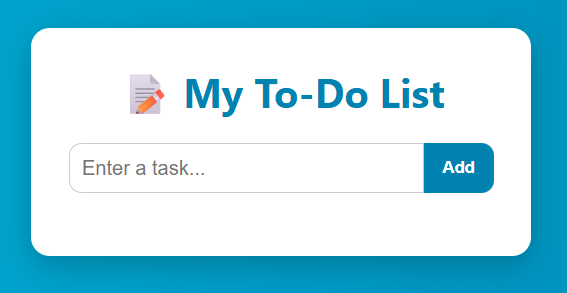

# 📝 To-Do List

A simple and visually appealing To-Do List web application using **HTML**, **CSS**, and **JavaScript**.

---

## 🚀 Demo

---

## ✨ Features

- ➕ Add new tasks
- ✅ Mark tasks as complete
- ❌ Delete tasks
- 💎 Clean, modern UI with responsive layout

---

## 📁 Files Included

- `index.html` – Structure of the app
- `style.css` – Styling and animations
- `script.js` – Functionality
- `screenshot.png` – Demo image

---

## 🛠️ How to Use

1. Clone or download the repository.
2. Open `index.html` in any browser.
3. Start managing your tasks!

---

## 📌 Note

- Click on a task to mark it as **completed**.
- Click the 🗑️ button to **delete** a task.

---

